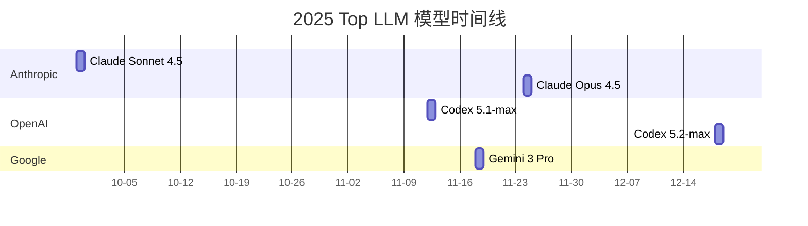

{: .info}
2025 的总结就是落落落落落起起。虽然途经低谷，但总还算是向着垭口前行。诚如《普罗米修斯》中的台词，人生是旷野，而不是轨道。2025 沿着轨道按部就班走了一年，2026 的愿景就是旷野的探索。

<!--more-->
---

> 读博之后，已经很久没有认真记录过生活和旅程了。于是在年末的某天翻过了之前高中写下的诗集之后，细数惭愧，我决定写一些文字记录这一年。或许也是在 AI 浪潮的裹挟下，我想要保留一些生活的慢节奏，以此证明自己还是一个有温度的人类，而不是在规定好的工作流上孜孜不倦运转的智能体。

## 关于旅途和生活

> 好好生活，慢慢相遇。

### 旅行与演唱会
2025 年的旅行，年初二月份本来计划去日本参加 SECCON，签证完了之后，但是由于各种不让出国比赛的经典原因，只能作罢，继 2024 年 DEFCON 美签作废之后，又作废一份日签。幸运的是，抢到了黄老板（Ed Sheeran）二月份在杭州的演唱会门票，和朋友们一起去看了现场，算是弥补了一些遗憾。

{% include figure.html src="/assets/images/260103/ed1_release.png" alt="Ed Sheeran Concert" width="65%" caption="杭州 · Ed Sheeran 演唱会" %}

第一次体验 Live Looping 的演唱会模式，黄老板一人一吉他撑起了整个舞台。不过没有舞美以及布景设计，确实有点素，所以有些人是吐槽诚意不够。不过现场气氛还是很不错的，黄老板唱功在线，而且几乎是全程弹唱了两个多小时，机能太顶了，作为十年老粉而言，我觉得还是很值的。
{% include figure.html src="/assets/images/260103/ed2_release.png" alt="Ed Sheeran Concert" width="50%" caption="Live Looping" %}

杭州回来之后就没出远门旅行了，不过演唱会倒还是去了不少，如下。

5 月份凤凰传奇在鸟巢的演唱会，和朋友试着抢票玩一玩，没想到还真的抢到了。八万人合唱的场景确实还是非常震撼的，不过中间有些 DJ 打碟的环节属于有点过于吵闹了，对心脏不太友好。
{% include figure.html src="/assets/images/260103/fhcq.png" alt="凤凰传奇演唱会" width="65%" caption="凤凰传奇鸟巢演唱会" %}



转眼间听许嵩已经十几年了，这次去许嵩的天津演唱会，也算是圆了小时候的一个愿望，但是不得不感慨这个男人看起来一点都没变老。
印象里面第一首歌是小学时候听的《断桥残雪》，即使放到现在这样的词曲水准也依旧不过时。不过，“过气歌手”许嵩的票怎么就这么难抢呢？许嵩的票我抢了好几轮，最后还是 lcy 学长帮忙才抢到的。
{% include figure.html src="/assets/images/260103/song1.png" alt="许嵩" width="65%" caption="" %}
{% include figure.html src="/assets/images/260103/song2.png" alt="许嵩" width="65%" caption="呼吸之野天津演唱会" %}
> 现场最多的还是紫色妹妹，不过有些是男妹妹？（雾）
{: .simple}



想去看这场演唱会的原因是看了之前《乘风》里面美依礼芽几个比较出圈的现场，再加上很久没有感受二次元现场的氛围了，所以决定提升一下浓度？
总体而言不算满意的一场演唱会，不过是主办方的问题，场地选择和音响效果都不太好，甚至票价都没有区分度，除了最前排，坐哪儿都是一样的。感觉有点儿被割韭菜的感觉。
{% include figure.html src="/assets/images/260103/myly.png" alt="美依礼芽演唱会" width="65%" caption="美依礼芽北京演唱会" %}

---

### 自由的旅途
> 我梦寐以求，是真爱和自由。<cite>郑钧《私奔》</cite>
> {% include figure.html src="/assets/images/260103/dongling.png" alt="东灵山" width="85%" caption="北京·东灵山" %}

上面的图是 2025 年 7 月徒步东灵山的时候领队小姐姐拍的，这张图我给满分。
阔别已久的老同学 yhx 在北京实习，约了我去爬东灵山--北京最高峰。作为徒步小白，起初我是很抗拒的，想去更简单的北灵徒步路线。但是很庆幸 yhx 坚持要去东灵山，结果证明这是一次非常棒的徒步体验。

出发当天六点醒来看见门头沟暴雨蓝色预警心凉了一半，没想到雨后的东灵反倒是锦上添花。全程 12km 的徒步与 800m 的爬升，解锁 2303m 的东灵峰，以及京西阿勒泰的名不虚传的高山草甸风光。 
{% include figure.html src="/assets/images/260103/dl1.png" alt="东灵山" width="85%" caption="山麓的云层" %}
---

大风雾里爬山体验却难得很不错，上山的整体感觉就是走在云里。尽管峰顶视野极差，基本只能感受雾和狂风，但是震撼的是下山时候雾刚好开始散开，透出阳光和远方的山脉，切实感受到云卷云舒，也是很难得体验到登高的意义。不愧是京西阿勒泰 ，一切都很完美，只是有点费膝盖。
{% include figure.html src="/assets/images/260103/dl6.png" alt="东灵山" width="85%" %}
{% include figure.html src="/assets/images/260103/dl4.png" alt="东灵山" width="85%" caption="东灵山"%}






---

> 你要爱荒野上的风声，胜过爱贫穷与思考。<cite>陈鸿宇《途中》</cite>
> {% include figure.html src="/assets/images/260103/wlcb4.png" alt="乌兰察布" width="100%" caption="内蒙古 · 乌兰察布" %}

8 月份的时候，又顺便去了一趟乌兰察布。草原的辽阔的确能够疗愈人心，天地阔远，荒野风声，盖过一切琐碎杂念，这里是特别适合放空和思考的地方。不管是湖泊草原还是荒野火山，都是逃离北京的嘈杂喧嚣生活的好去处。步履不停，途中所见，皆为风景。在乌兰察布的旅程中听着陈鸿宇的《途中》，这种契合的意境唯有在在慢慢行进的路上才能感之真切。
{% include figure.html src="/assets/images/260103/wlcb7.png" alt="乌兰察布" width="85%" caption="辉腾锡勒 · 湖泊" %}
{% include figure.html src="/assets/images/260103/wlcb6.png" alt="乌兰察布" width="85%" caption="辉腾锡勒 · 花海" %}
{% include figure.html src="/assets/images/260103/wlcb10.png" alt="乌兰察布" width="85%" caption="辉腾锡勒 · 风车"%}
{% include figure.html src="/assets/images/260103/wlcb9.png" alt="乌兰察布" width="85%" caption="乌兰哈达火山 · 飞鸟" %}

## 关于学术与工作

25 年的不顺，主要来源于论文投稿，用坎坷离奇来形容也不为过，不过到了年末，一整年的努力付出终究还是有所收获。

### 论文投稿

今年的投稿历程只能说时运不济，第一篇工作投了 25 欧密，第一轮 review 看起来非常不错，一个明确的 accept，以及两个模糊的 weak accept 评价（实际有一个 weak reject），没想到 2025 年初一月底的最终轮被拒收，理由是技术创新性不够。随后，我就开启了 2025 年的三大密码顶会的拒稿流水线，后面相继投了美密会，亚密会，分数都在 borderline 附近，但都刚好有一个审稿人给 weak reject，拒稿理由也都相当主观，rebuttal 的作用感觉微乎其微。每次投稿都能碰到：

- 善良的正向审稿人
- 挑剔的负面审稿人
- 折衷的保守审稿人
  
可惜的是，每次善良的审稿人都没能斗过挑剔的审稿人，AC 貌似特别看重给低分的意见。但是幸运的是，不管是正向还是负面的意见，也都让我觉得这篇工作继续做下去是很有意义的，尤其是给高分的审稿人给了非常高的情绪价值（参考下图），在此特别致谢这些匿名审稿人。

{% include figure.html src="/assets/images/260103/review.jpg" alt="review" width="85%" caption="善良的正向审稿人"%}

7 月份亚密被拒之后，修改后加了一些新的想法和证明，篇幅也快到 60 页了，这已经不是一篇会议论文可以接受的长度了。于是我和合作的老师讨论之后，决定对论文做减法，事实证明，这是我 25 年最正确的明智之举。在 8 月到 10 月中旬，我改了整整两个半月的论文，每天都是打开 vscode 的论文 latex 目录，读写论文，实现代码以及润色论文，除此之外几乎没有做其他事情。算是完整地完成了两篇论文从 idea 到代码实现，写作到投稿的全过程。最后，第一篇工作继续投了EUROCRYPT 2026，第二篇投了密码学高性能实现的小顶会 CHES 2026。幸运的是第二篇 CHES 一次投稿就中了。虽然历经了一点曲折，今年也完成了博士的开题，正式成为了一位 PhD Candidate。

> 总之论文工作推进到这里，需要感谢很多人，比如两位合作的老师，以及孜孜不倦 push 我的 lcy 学长，还有帮忙推进论文实现的 suansuan。
<!-- {: .simple} -->

论文投稿导致 25 年下半年很多目标都没来得及做，最可惜的是今年的 nsu-crypto 奥林匹克密码学竞赛刚好撞上了我论文的截稿日，还是没能填补去年没拿金牌的遗憾。

### 鹅厂实习

今年去了腾讯（鹅厂）实习，也算是体会到了 “有鹅选鹅” 的含金量。说起来，也是非常凑巧的一次双向奔赴。八月中旬刚好是亚密被拒之后，我正处于被论文折磨的最痛苦的阶段，想着投完这两篇论文和开题结束之后，就应该去找实习了。恰好这个时候，由于我 CTF 比赛的相关成绩，鹅厂这边的 HR 通过我朋友找到了我，说这边有密码学相关的实习岗位。于是，一拍即合，三轮面试之后，顺利拿到了鹅厂的实习 offer。

{% include figure.html src="/assets/images/260103/tx.png" alt="tencent" width="85%" caption="北京初秋·鹅厂"%}

实习的组的团队氛围非常好，我也真实体会到了大厂的工作节奏和氛围，甚至一点儿都不卷，作为实习生活而言，简直算得上舒适。虽然一开始进来是打算做后量子相关的工作的，但是和我想象的内容有所出入。于是我开始接触 LLM 驱动的自动化漏洞挖掘和利用的相关工作，并且在这边的成果产出也出乎意料地多，挖到了许多很有意思的漏洞（10 + 的高危 CVE）。非常感谢 mentor（Atum） 以及其他同事的指导和帮助，也确实学到了很多东西，尤其是在 LLM 和 Agent（智能体）方面的应用经验。

## 关于 CTF 比赛

今年参加 CTF 比赛，越来越明确地感觉到 CTF 的密码方向很快就要变成大模型的天下了，我估计也准备退役了。今年打得最投入和最有成就感的比赛是 CryptoCTF：我，debato 还有 suansuan 三个人把所有题 AK 了，最后拿了第二（总分并列第一）。这场比赛倒还是有很多趣事：邻近比赛前一天，由于以色列和伊朗的冲突升级，导致主办方（伊朗）不得不延后了这场比赛，这是第一次切实感受到国际局势的影响。
在我们参加 CryptoCTF 的时候，大模型还只是初露峥嵘，印象最深的是 gemini 给了一个谷歌的 sat/milp 求解工具 ortools，从而秒了一道卡了我们很久的题。

大模型展现统治力的最大转折点大概是今年9到10月左右，也就是 claude sonnet 4.5 模型发布的时间段，随后 codex 5.1 和 gemini 3 pro 出来之后，明显感觉到一般的密码学题目已经是从解题思路到代码实现都能 90% 外包给大模型了，剩下 10 % 就是人工的提需求和指方向。按照 suansuan 的说法就是：

> 现在的 CTF 竞赛很无聊了，整天都在与神明对话。

是的，当你问 C 神（ChatGPT）得不到答案，那你就去问 G 神（Gemini）。这些话并不是玩笑，因为后半年不论是国内还是国际的顶尖 CTF 比赛的密码赛题，大模型几乎能秒 90 % 的赛题，目前现阶段最好的通用模型 Gemini 3 Pro  + 最强的编程 Claude Opus 4.5，只要愿意烧 token，不需要专门设计智能体，也能解绝大部分密码学题。如果再加一个有经验的密码手，估计 Crypto 方向一人就能顶之前五个人用，AI 提效恐怖如斯。举几个相当离谱的例子，2025 n1ctf 的一道论文题甚至可以在不需要知道论文的情况下，将代码喂给大模型，然后就能在思考几分钟的情况下，给你一个完整的 exp。最近 0ctf 的一道求四立方和的问题，也能让大模型学习一些现有论文和 stackoverflow 的相关讨论的情况下，给出一个可行的解法。起初以为这是一道简单题，后来才知道这题的 idea 在投一篇数学顶会。总之，随着大模型和 Agent 水平的提升，普通 CTF 密码赛题已经没有什么乐趣了。为在比赛中对抗大模型的使用（Anti-LLM），今年 RCTF 我出了两道 sagemath 的伪随机数生成器的题，这两题不太能被大模型秒了的原因在于代码审计的上下文很长，在没有人工审计的情况下 LLM 很难自己分析到 gmp 的源码。意外的是，这个二连题的唯二解，居然都是非预期解法，不过思路也很有意思。从赛后题解看来，基本这题只能用 LLM 辅助分析，不太能丢给 LLM 一把梭了。

这一年估计不会怎么打比赛了，其一是大模型崛起后，很多技巧性的题，论文题失去了乐趣，CTF 比赛和编程比赛之类的脑力竞赛，似乎已经被 LLM 逐渐杀死，AGI 时代会优化掉多少技术方向，还未可知，至少目前 Vibe Coding 已经杀死传统编程，学术研究范式更是瞬息万变。其二是我觉得设计一个 Agent 解题可能更有趣（打不过就加入），LLM 智能体和 AI 大幅提效已经是大势所趋。特别是学术方面（Vibe Research），当你有一个 idea 之后，设计一个 Agent 进行调研，扩展都是很有意思的工作，特别是给大模型一些领域 SOTA 的上下文工作，让大模型基于现有技术去提升性能，或尝试将其他领域的技术应用到新方向，都非常 promising。2025 可以称得智能体元年，AI 智能体能力显著提升的一年，研究范式被不断冲击，比如如今的代码编写已经全面进入 Vibe Coding，编程似乎已经不再需要门槛了，我也确实该调整自己的研究思路和工作流了。恰好今年写年终总结，尝试使用了一下 Manus + Nano Banana Pro 的智能体做 PPT，只能说如今的 AI 提效能力，远超预期，比如下面的一页 PPT 仅仅通过一句 Prompt 即可在两分钟内生成：

> 根据 NeSE 官网 https://nese.team/awards/2025/ 的数据，总结 tl2cents 这一年的 CTF 比赛成绩，生成相关统计作为一页 PPT。

{% include figure.html src="/assets/images/260103/ctf-summary.jpg" alt="review" width="85%" caption="Manus 生成的 CTF 2025 年度总结"%}

新的一年，毋庸置疑，研究和使用 LLM Agent 是绕不开的。另一方面，大模型出来了之后，数学的学习成本大幅下降，特别是借助 Gemini 优秀的推理能力，理解复杂的证明变得相对简单，回想起本科学机器学习的时候，各种凸优化和实分析最终劝退了我去研究 AI 底层的热情。2026 年，借助大模型补一些之前没能深究的数学领域，也在我的计划之中。希望这些立下的 flag 不会倒掉。